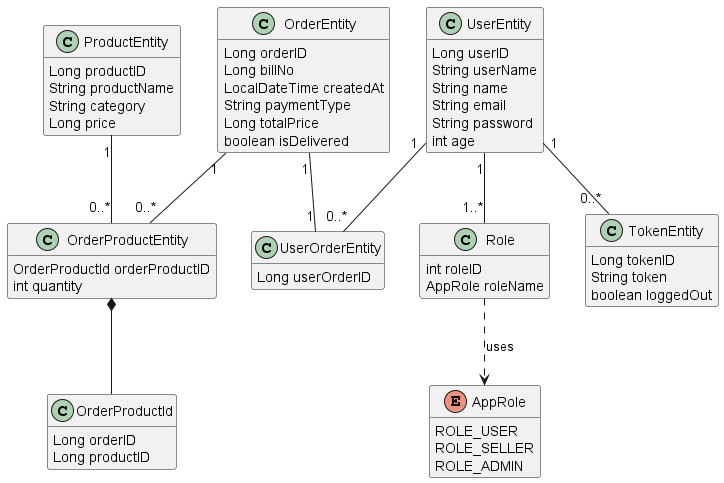
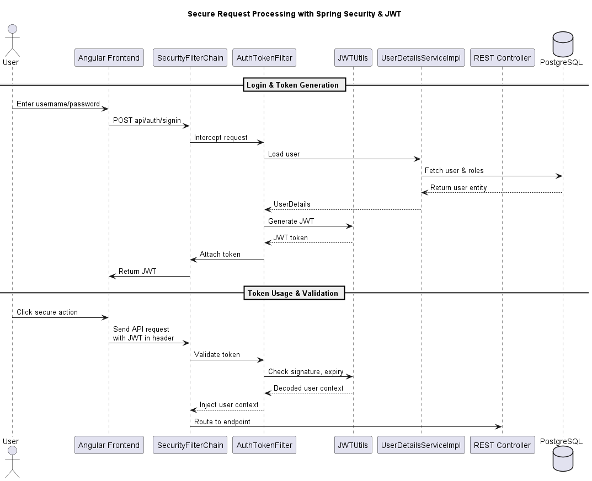

# OrderNest
**OrderNest** is a modular order management service designed to help users browse products, place orders, and track everything with ease.

## Features

- JWT-secured user authentication and role-based access control enforced via Spring Security  
- Product catalog management with Spring Data JPA  
- RESTful endpoints for streamlined order processing  
- Comprehensive logging with Log4j  
- Angular based UI for user interaction  
- Deployment on Google Cloud Platform for a scalable, production ready full stack solution 

## Tech Stack

### Core Backend Technologies
     
  

### Database Technologies
 

### Cloud Deployment (Google Cloud Platform)
   

### Build Tools

  

  

### Containerization & Runtime Environment

### API Testing & Documentation
 

### Frontend Technologies

---

## Domain Model Class Diagram	

---

## Secure Request Processing in Spring Boot

---

## Cloud-Native Deployment Pipeline 

---
